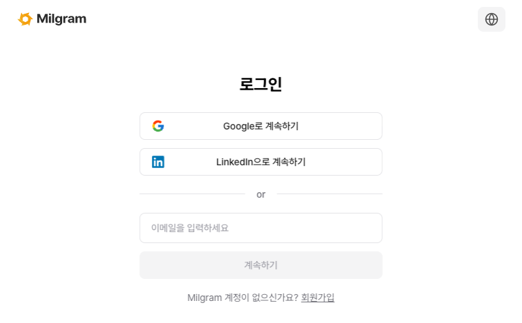
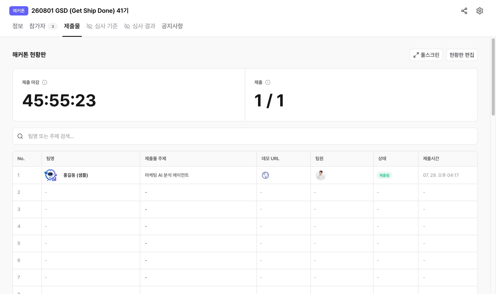
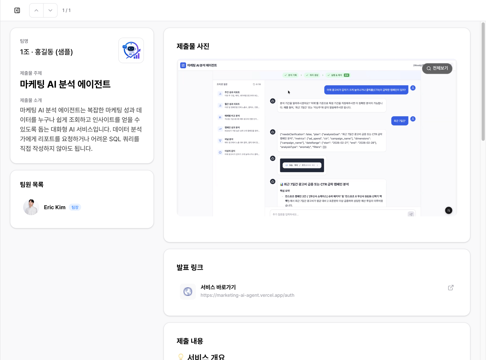
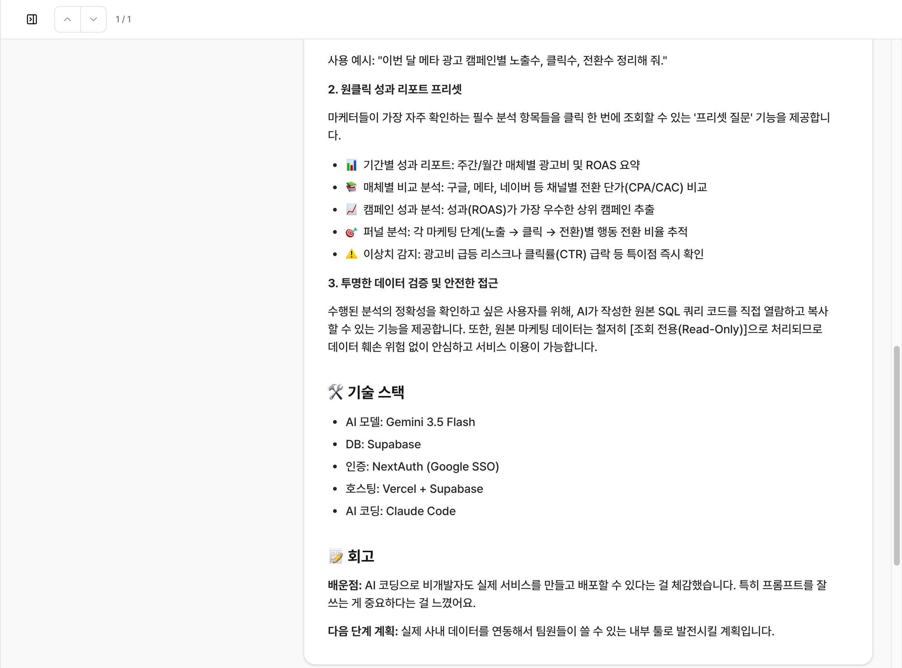

# GSD 제출물 등록 가이드

오늘 만든 프로젝트를 밀그램 이벤트 페이지에 올리는 방법입니다.
**터미널에 명령 한 줄 붙여넣기 → Claude에게 "제출해줘" 한마디**, 이 두 단계가 전부입니다.

처음이라도 5분이면 됩니다. 순서대로 따라오세요.

---

## 목차

1. [먼저 확인할 것](#1-먼저-확인할-것)
2. [설치 — 딱 한 줄](#2-설치--딱-한-줄)
3. [Claude Code 다시 실행](#3-claude-code-다시-실행)
4. [제출 요청하기](#4-제출-요청하기)
5. [밀그램 로그인 (최초 1회)](#5-밀그램-로그인-최초-1회)
6. [회고 답하기](#6-회고-답하기)
7. [등록 확인](#7-등록-확인)
8. [내용 고치고 싶을 때](#8-내용-고치고-싶을-때)
9. [문제가 생기면](#9-문제가-생기면)

---

## 1. 먼저 확인할 것

딱 두 가지입니다.

| 확인 | 왜 |
|---|---|
| **Google Chrome이 설치되어 있는지** | 밀그램에 접속하는 데 씁니다. Safari·Arc 등으로는 안 됩니다 |
| **GSD 참가 신청에 쓴 이메일이 무엇인지** | 그 계정으로 로그인해야 제출이 됩니다 |

Chrome이 없으면 [google.com/chrome](https://www.google.com/chrome/)에서 설치해 주세요.

> Node.js 같은 개발 도구는 몰라도 됩니다. 없으면 알아서 깔립니다.

---

## 2. 설치 — 딱 한 줄

터미널을 열고 아래를 **그대로 복사해서 붙여넣고** 엔터를 누르세요.

```bash
git clone https://github.com/onedegreelabs/gsd-skills ~/gsd-skills && mkdir -p ~/.claude/skills && ln -sfn ~/gsd-skills/skills/gsd-submit ~/.claude/skills/gsd-submit
```

`Cloning into ...` 같은 메시지가 나오고 끝나면 성공입니다.

> **터미널을 어떻게 여나요?**
> `Command(⌘) + Space` → `터미널` 입력 → 엔터

---

## 3. Claude Code 다시 실행

**중요:** 이미 켜져 있는 Claude Code 창에는 방금 설치한 기능이 잡히지 않습니다.
**Claude Code를 완전히 끄고 새로 실행**해 주세요.

그리고 **오늘 작업한 프로젝트 폴더에서** Claude Code를 켜야 합니다.
Claude가 그 폴더의 작업 기록을 읽어서 제출물 내용을 만들기 때문입니다.

---

## 4. 제출 요청하기

Claude에게 이렇게 말하면 됩니다.

```
밀그램에 제출해줘
```

이런 말도 다 알아듣습니다.

- `오늘 만든 거 등록해줘`
- `GSD 제출물 올려줘`
- `다 만들었어, 올려줘`

그러면 Claude가 알아서 이 일들을 합니다.

1. 오늘 Claude와 나눈 **작업 기록과 코드를 읽어** 무엇을 만들었는지 정리
2. 만든 서비스 **화면을 캡처**해서 대표 이미지로 준비
3. **오늘 열린 기수 이벤트**를 찾아 빈 자리에 팀 등록
4. 제출물을 올리고 **공개 링크**를 알려줌

---

## 5. 밀그램 로그인 (최초 1회)

처음 쓸 때만 나오는 단계입니다. 필요한 도구가 자동으로 깔리고 나면,
**Chrome 창이 하나 새로 열리면서 이번 기수 이벤트 페이지가 뜹니다.**


이 창에서 **우측 상단 `로그인`** 을 눌러 주세요.



**GSD 참가 신청에 쓴 계정**으로 로그인합니다. 세 가지 방법 중 편한 걸 쓰시면 됩니다.

- `Google로 계속하기`
- `LinkedIn으로 계속하기`
- 이메일 입력 → `계속하기`

로그인이 확인되면 Claude가 알아서 다음 단계로 넘어갑니다. 터미널로 돌아가지 않아도 됩니다.

> ### 왜 새 창이 뜨나요?
> 평소 쓰는 브라우저를 건드리지 않기 위해 **제출 전용 창**을 따로 씁니다.
> 그래서 평소 Chrome에 이미 밀그램 로그인이 되어 있어도, 이 창에서는 한 번 더 로그인해야 합니다.
> **한 번만 하면 됩니다.** 다음 기수부터는 이 단계가 아예 안 나옵니다.

> ### 구글 로그인이 막히면
> "안전하지 않은 브라우저"라는 메시지가 나올 수 있습니다.
> 그럴 때는 **이메일 로그인**을 쓰시면 됩니다.

---

## 6. 회고 답하기

Claude가 딱 한 번 질문을 합니다. **회고**입니다.

```
작업 기록을 보면 배포 설정에서 30분쯤 막혔다가 환경변수 문제로 풀렸네요.

제출물 회고에 넣을 두 가지만 알려주세요 (짧아도 됩니다)
1. 오늘 배운 것 / 느낀 점
2. 이 프로젝트를 앞으로 어떻게 할 계획인지
```

기능이나 기술 스택은 코드를 보면 알 수 있지만, **무엇을 느꼈고 앞으로 어떻게 할지는
본인만 알기 때문에** 이것만 직접 물어봅니다. 지어내지 않습니다.

짧게 답해도 됩니다. 이렇게만 써도 충분합니다.

```
1. 클로드 코드를 어떻게 시작해야 할지 막막했는데 이번 교육이 좋은 계기가 됐다
2. 앞으로 레이아웃을 지정해서 자동 생성을 더 시켜볼 계획
```

말투는 그대로 살리고 오타랑 문장만 다듬어서 올라갑니다.

---

## 7. 등록 확인

끝나면 Claude가 이렇게 알려줍니다.

```
등록 완료 — 41기 제출물 2번 자리
https://www.milgram.io/ko/event/{이벤트ID}/builds
```

링크를 열면 목록에 내 제출물이 보입니다. `내 제출물` 배지가 붙어 있습니다.



내 줄을 클릭하면 상세 화면이 열립니다. 팀명·주제·소개·사진·발표 링크가 채워져 있습니다.



아래로 내리면 **제출 내용**이 나옵니다. 이 형식으로 정리됩니다.



| 섹션 | 내용 |
|---|---|
| 💡 서비스 개요 | 한 줄 요약 |
| 🔗 프로젝트 URL | 배포 링크 |
| ✨ 핵심 기능 | 기능별 설명 |
| 🛠 기술 스택 | 무엇으로 만들었는지 |
| 📝 회고 | 배운 점 / 다음 계획 |

---

## 8. 내용 고치고 싶을 때

그냥 Claude에게 말하면 됩니다.

```
회고 부분 다시 써줘
이미지를 메인 화면으로 바꿔줘
제목을 "○○○"로 고쳐줘
다시 제출해줘
```

**다시 제출하면 같은 자리를 덮어씁니다.** 새 줄이 생기지 않으니 마음 편히 고치세요.

---

## 9. 문제가 생기면

### 웹 서비스가 아니라 자동화 스크립트를 만들었어요

괜찮습니다. 화면이 없는 프로젝트는 **결과물**을 찍어서 올립니다.
자동으로 채워진 구글 시트, 만들어진 리포트, 도착한 슬랙 메시지 같은 것들요.
Claude가 알아서 찾거나 물어봅니다.

### 배포를 안 해서 링크가 없어요

로컬에서만 돌아도 됩니다. Claude가 로컬 서버를 띄워 화면을 캡처합니다.
링크는 비워두고 제출됩니다.

### `참가자가 아닙니다` 라고 나와요

로그인한 계정이 이 기수 참가자로 등록되어 있지 않습니다.

1. **GSD 신청에 쓴 이메일과 같은지** 확인해 주세요 (다른 계정으로 로그인한 경우가 대부분입니다)
2. 같은데도 안 되면 **운영진(지팡이)에게 말씀해 주세요**

### `빈 자리가 없습니다` 라고 나와요

현황판 자리가 다 찼습니다. **운영진에게 자리 추가를 요청**해 주세요.

### `제출 기간이 아닙니다` 라고 나와요

마감이 지났습니다. 마감 시간은 운영진만 조정할 수 있으니 말씀해 주세요.

### 로그인했는데 계속 로그인하라고 해요

**평소 쓰는 Chrome이 아니라 새로 열린 전용 창**에서 로그인해야 합니다.
창이 안 보이면 Claude에게 `로그인 창 다시 띄워줘` 라고 말하세요.

### 팀으로 참가했어요

**팀장 한 명이** 대표로 제출하면 됩니다. 한 이벤트에서 한 사람은 한 팀에만 속할 수 있습니다.

### 그 외에 막히면

Claude에게 그대로 말해 주세요. 에러 메시지를 읽고 무엇을 해야 하는지 알려줍니다.
해결이 안 되면 운영진(지팡이)에게 화면을 보여주세요.

---

## 참고

- 스킬 저장소: [github.com/onedegreelabs/gsd-skills](https://github.com/onedegreelabs/gsd-skills)
- 자세한 세팅 설명: [setup.md](skills/gsd-submit/references/setup.md)
- 제출물 형식 규격: [submission-format.md](skills/gsd-submit/references/submission-format.md)
